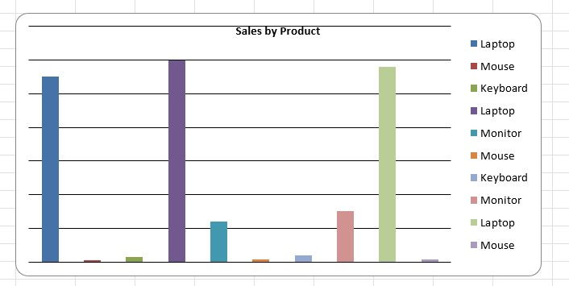
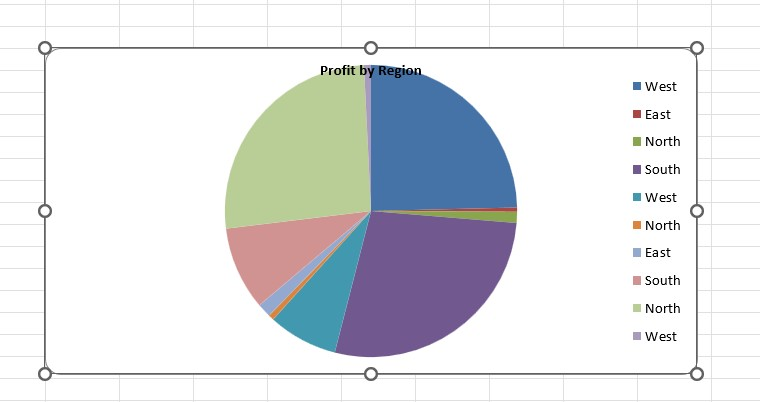
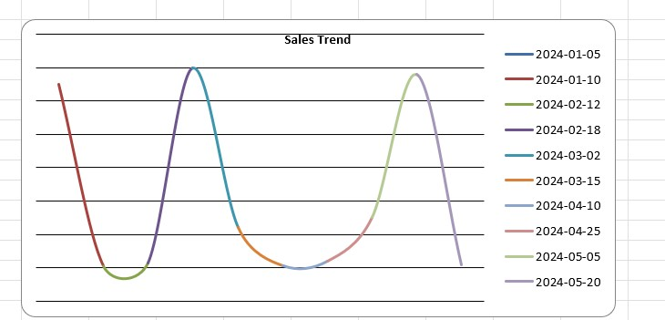

# 📊 Data Analysis Projects

## 🔹 Project: Sales Data Analysis

### 📁 Dataset
- Sales dataset containing product, region, sales, and profit details

### 🛠️ Tools Used
- Microsoft Excel
- Data Visualization (Charts)

### 📊 Analysis Performed
- Data cleaning and preprocessing
- Product-wise sales analysis
- Region-wise profit analysis
- Monthly sales trend analysis

### 📈 Visualizations

#### 🔹 Bar Chart (Product vs Sales)

#### 🔹 Pie Chart (Region vs Profit)

#### 🔹 Line Chart (Sales Trend)

### 💡 Key Insights
- Laptop has highest sales
- West and North regions generate more profit
- Sales show growth trend over months

---

## 🚀 Author
**Amar Chippawar**  
Aspiring Data Analyst
