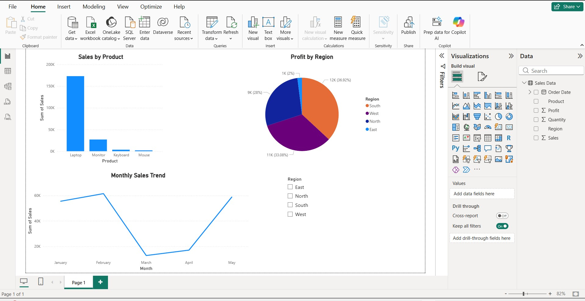

# 📊 Data Analysis Projects

This repository contains my Data Analyst projects using Excel and Power BI.

---

## 📌 Project 1: Sales Data Analysis (Excel)

- Analyzed sales dataset using Excel
- Created visualizations (Bar Chart, Pie Chart, Line Chart)
- Identified product performance and sales trends

---

## 📌 Project 2: IPL Data Analysis Dashboard (Power BI)

- Built an interactive dashboard using Power BI
- Analyzed team performance, player statistics, and match trends
- Implemented slicers for dynamic filtering (Season & Team)

---

## 🛠 Tools & Technologies

- Microsoft Excel  
- Power BI  
- Python (Basic)

---

## 📊 Power BI Dashboard

---

## 💡 Key Insights

- Laptop category has highest sales
- Certain regions generate higher profit
- Sales show monthly growth trend
- Top players consistently win awards
- Match distribution is consistent across seasons

---

## 👤 Author

Amar Chippawar  
Aspiring Data Analyst
